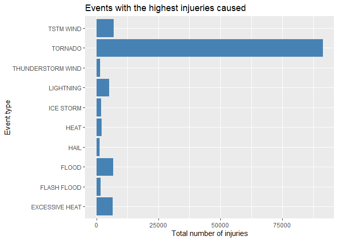
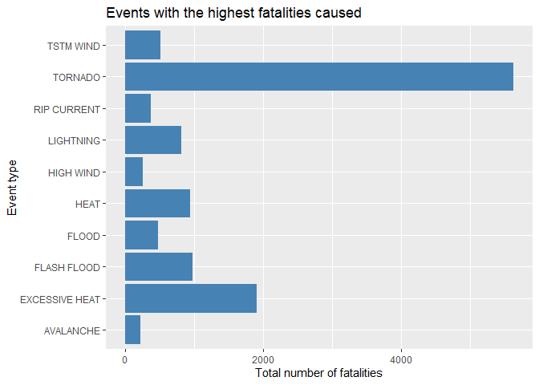
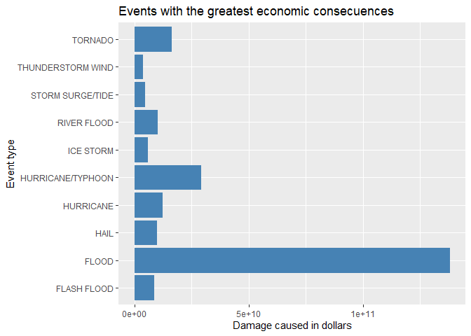

Synapsis
--------

Storms and other severe weather events can cause both public health and
economic problems for communities and municipalities. The basic goal of
this project is to explore the NOAA Storm Database in order to answer
the following questions:

1.  Across the United States, which types of events are most harmful
    with respect to population health?
2.  Across the United States, which types of events have the greatest
    economic consequences?

The database for the following analysis was obtained from the U.S.
National Oceanic and Atmospheric Administration’s (NOAA) storm database
from
<a href="https://d396qusza40orc.cloudfront.net/repdata%2Fdata%2FStormData.csv.bz2" class="uri">https://d396qusza40orc.cloudfront.net/repdata%2Fdata%2FStormData.csv.bz2</a>..
This database tracks characteristics of major storms and weather events
in the United States, including when and where they occur, as well as
estimates of any fatalities, injuries, and property damage.

Documentation available in
<a href="https://d396qusza40orc.cloudfront.net/repdata%2Fpeer2_doc%2Fpd01016005curr.pdf" class="uri">https://d396qusza40orc.cloudfront.net/repdata%2Fpeer2_doc%2Fpd01016005curr.pdf</a>

Data Processing
---------------

### Data loading

The data is loaded and stored in the dataframe “db”

    library(dplyr)

    ## 
    ## Attaching package: 'dplyr'

    ## The following objects are masked from 'package:stats':
    ## 
    ##     filter, lag

    ## The following objects are masked from 'package:base':
    ## 
    ##     intersect, setdiff, setequal, union

    library(ggplot2)

    fileUrl <- "https://d396qusza40orc.cloudfront.net/repdata%2Fdata%2FStormData.csv.bz2"
    download.file(fileUrl, destfile = 'repdata%2Fdata%2FStormData.csv.bz2')
    db <- tbl_df(read.csv("repdata%2Fdata%2FStormData.csv.bz2"))

### Injuries and fatalities

The total injuries by each event type are calculated and stored in
“dfInj”. Also the data is ordered from highest to lowest injueries
caused.

    dfInj<-summarise(group_by(db, EVTYPE), totalInj = sum(INJURIES))
    dfInj<-dfInj[order(dfInj$totalInj, decreasing = T),]
    head(dfInj)

    ## # A tibble: 6 x 2
    ##   EVTYPE         totalInj
    ##   <fct>             <dbl>
    ## 1 TORNADO           91346
    ## 2 TSTM WIND          6957
    ## 3 FLOOD              6789
    ## 4 EXCESSIVE HEAT     6525
    ## 5 LIGHTNING          5230
    ## 6 HEAT               2100

The same process is repeated with the fatalities caused by event and the
results are stored in “dfFat”.

    dfFat<-summarise(group_by(db, EVTYPE), totalFat = sum(FATALITIES))
    dfFat<-dfFat[order(dfFat$totalFat, decreasing = T),]
    head(dfFat)

    ## # A tibble: 6 x 2
    ##   EVTYPE         totalFat
    ##   <fct>             <dbl>
    ## 1 TORNADO            5633
    ## 2 EXCESSIVE HEAT     1903
    ## 3 FLASH FLOOD         978
    ## 4 HEAT                937
    ## 5 LIGHTNING           816
    ## 6 TSTM WIND           504

### Crop and property damage in dollars

Now exploring the damage multipliers for both, property and crops, we
realize that there are not representing values (-, ?, +) and there are
some upper and lower case values.

For property damage:

    table(db$PROPDMGEXP)

    ## 
    ##             -      ?      +      0      1      2      3      4      5      6 
    ## 465934      1      8      5    216     25     13      4      4     28      4 
    ##      7      8      B      h      H      K      m      M 
    ##      5      1     40      1      6 424665      7  11330

For crop damage:

    table(db$CROPDMGEXP)

    ## 
    ##             ?      0      2      B      k      K      m      M 
    ## 618413      7     19      1      9     21 281832      1   1994

In order to avoid confusion, all these values are converted to lower
case.

    db$PROPDMGEXP <- tolower(db$PROPDMGEXP)
    db$CROPDMGEXP <- tolower(db$CROPDMGEXP)

A function is created, it receives a damage exponent and returns the
equivalent numeric values for it.

    multiplier <- function(x) {
      if (x == "h") x<-100
      if (x == "k") x<-1000
      if (x == "m") x<-1000000
      if (x == "b") x<-1000000000
      x
    }

A new dataframe that contains the significant values of damage exponent
(h, k, m, b) is created.

    damage<- filter(db, (PROPDMGEXP %in% c("h", "k", "m", "b") & (CROPDMGEXP %in% c("h", "k", "m", "b"))))
    damage<-select(damage, c(EVTYPE, PROPDMG, PROPDMGEXP, CROPDMG, CROPDMGEXP))

Then, the function “multiplier” is applied for converting all the damage
exponents into numbers. And these numbers are multiplied to get the
actual damage for each row, in Total Property Damage (tdp) and Total
Crop Damage

    damage$PROPDMGEXP <- sapply(damage$PROPDMGEXP, multiplier)
    damage$CROPDMGEXP <- sapply(damage$CROPDMGEXP, multiplier)

    damage <- mutate(damage, tpd=PROPDMG*PROPDMGEXP)
    damage <- mutate(damage, tcd=CROPDMG*CROPDMGEXP)

As we did before, all the data is grouped by event type and the total
sum of damage is calculated, for each crop and property damage. After
that, Crop and Property damage are merged in one dataframe. The crop
damages are added to the property damages in order to get the total
damage. Finally, the data is ordered by the amount of total damage.

    dfCrop<-summarise(group_by(damage, EVTYPE), totalDmg = sum(tcd))
    dfProp<-summarise(group_by(damage, EVTYPE), totalDmg = sum(tpd))

    dfDamage <- merge(dfCrop,dfProp, by="EVTYPE", suffixes = c("Crop", "Property"))
    dfDamage <- mutate(dfDamage, totalDmg=totalDmgCrop+totalDmgProperty)
    dfDamage<-dfDamage[order(dfDamage$totalDmg, decreasing = T),]

Results
-------

The event types with the highest number of injuries are:

    ggplot(head(dfInj,10), aes(x=EVTYPE, y=totalInj))+geom_bar(stat="identity", 
      fill="steelblue")+coord_flip()+ylab("Total number of injuries")+
      xlab("Event type")+ labs(title="Events with the highest injueries caused")

The event types with the highest number of fatalities are:

    ggplot(head(dfFat,10), aes(x=EVTYPE, y=totalFat))+geom_bar(stat="identity", 
      fill="steelblue")+coord_flip()+ylab("Total number of fatalities")+
      xlab("Event type")+ labs(title="Events with the highest fatalities caused")

The event types with the highest damages are:

    ggplot(head(dfDamage,10), aes(x=EVTYPE, y=totalDmg))+geom_bar(stat="identity", 
      fill="steelblue")+coord_flip()+ylab("Damage caused in dollars")+
      xlab("Event type")+ labs(title="Events with the greatest economic consecuences")

